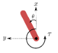
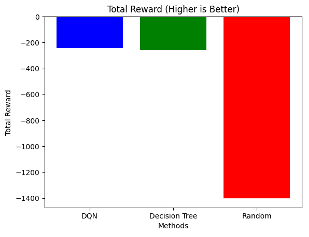
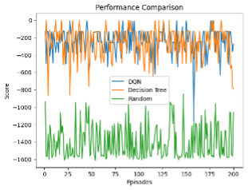
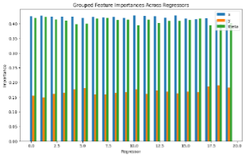
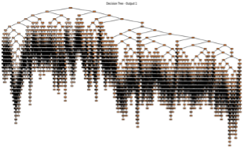
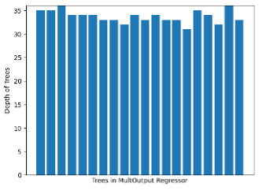
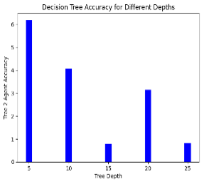
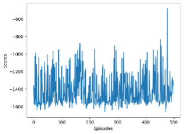
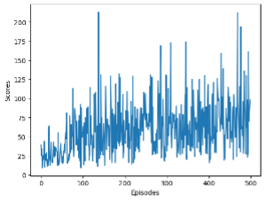

# TreeQN: A Fast and Interpretable XAI Technique for Simple Reinforcement Learning Challenges

    - Jeyakumar Sriram
    - Diploma in Applied Artificial Intelligence and Analytics
    - School of Computing
    - Singapore Polytechnic

**_Abstract—_** With the rise in public sentiment regarding the opacity of AI and the subsequent need for Explainable AI (XAI), this paper proposes the use of Decision Trees as surrogate models for simpler applications within RL. Additionally, the paper illustrates how Replay Transitions generated by a Deep Q-Network (DQN) can be mined to train a surrogate model that not only matches the performance of the original DQN but also offers interpretability and speed advantages.

**_Index Terms—_** Reinforcement Learning, Decision Trees, Q-Learning, Explainable AI, Interpretability, Surrogate Modeling

## Introduction

With the advent of affordable computing power, large Neural Networks have become viable solutions to many contemporary problems. Various applications, including weather simulation, medical diagnosis, business optimization, and automation like autonomous cars, have experienced notable advancements through the implementation of these innovative Artificial Intelligence (AI) techniques. However, the public's growing concerns about the opacity of AI underscore the need for interpretable and understandable models. Despite their proficiency as function approximators, Neural Networks exhibit drawbacks, such as poor interpretability and increased computational demands, when compared to traditional machine learning algorithms. These challenges persist in the realm of reinforcement learning too. In this paper, we seek to combine Decision Trees and Q-learning to create lightweight and transparent algorithms which can solve tasks such as balancing an inverted pendulum or maintaining the equilibrium of a pole on a cart.

## Related Works

In accordance with public sentiments, Explainable AI (XAI) has become an active field of research. While XAI for Convolutional or Recurrent Neural Networks have seen recent advancements, we will be focusing on Q-Networks for this paper. Deep Q-Networks were first introduced by DeepMind in their groundbreaking paper \[1\] which introduced the usage of Neural Networks for Q-Learning to play Atari. Since then various methods such as using Saliency Maps \[2\], Local Interpretable Model-Agnostic Explanations \[3\] and SHapley Additive exPlanations\[3\] have been proposed.

However, when it comes to solving simple problems like the pendulum swing task in OpenAI Gym, where the dynamics are well-defined, complex neural network-based explanations might be computationally expensive and provide overly detailed explanations. Decision Trees offer a concise visualization of the decision boundaries in the input space, making them here. Using common libraries like GraphViz to visualize the trees, users can quickly understand how different input states lead to specific actions, providing a more intuitive and transparent means of interpretability for such problems.

As outlined by Mnih et al., the Q-learning process is based on the Markov Decision Process (MDP) which provides a mathematical structure to represent and solve problems in an uncertain environment. The Markov Property signifies that future state of a system is only dependent on its current state and current action, not the sequence of events that preceded it. Using this property, the Q-learning process is designed around approximating a function Q such that.

![State-action value function (Q function) - Hands-On Reinforcement Learning  with Python \[Book\]]

The Q function is then estimated using the Bellman equation which embodies the concept of temporal difference learning:

This equation expresses the relationship between current state-action pairs, the sum of the immediate reward and a discounted value of the next state. This temporal difference learning enables the agent to update its estimates iteratives as it gets more information.

Exploration-Exploitation Trade-off is another key component in Q-learning where the learning agent constantly faces the dilemma of discovering new paths or choosing safer paths that give the highest reward based on its current knowledge. Striking the right balance is crucial for the agent to learn a optimal policy.

The SARSA (State-Action-Reward-State-Action) algorithm is a crucial element in reinforcement learning, focusing on updating its policy iteratively by improving it based on the learned state-action values. The goal is to converge towards an optimal policy (π̂) that maximizes the expected cumulative reward over time.

## Methodology

### _Environment_

We will be utilizing the OpenAI Gym Environment as our testing ground, with a particular focus on the Pendulum game to evaluate both the performance and interpretability of our model. In this environment, the objective of the algorithm is to apply the right amount of torque to the pendulum to balance it above its fixed point. This selection is motivated by Pendulum environment's unique characteristics, including its continuous action space and simple dynamics.

The observation space for this environment is a ndarray containing where x-y are cartesian coordination of the pendulum’s end in meters and . The start state will be a random in the range \[\] and a random angular velocity in the range \[-1,1\]

The action space for this environment is an ndarray containing () which is the torque applied in Nm, defined as positive counter clockwise.

Each episode will truncate at 200-time steps. The reward function for this problem is defined as:

Using the best-case scenario of an upright pendulum with 0 velocity and 0 applied, the minimum reward that can be obtained is -16.2 (3 s.f.)

### _Neural Networks_

To use neural networks for this task, we will be creating a simple Multi-Layered Perceptron that outputs one value for each action. This output is interpreted as the neural network’s Q-value for that function. Instead of using a simple DQN, I will be using a Dueling Double DQN (D3QN) as per implemented in the paper "Dueling Network Architectures for Deep Reinforcement Learning" by Ziyu Wang. We will be using PyTorch to build our model.

### _Experience Replay_

When training DQNs, we cannot just backpropagate every step as it might not lead to convergence. Instead we store transition tuples which contain (state, action, reward, next_state). These tuples will be stored in a circular buffer of fixed size N, which can be defined by the user. When the neural network backpropagates, n samples will be randomly sampled from this circular buffer to be used for training. This random sampling breaks the temporal correlation of consecutive experiences, helping to decorrelate the data and avoid overfitting to specific sequences. This batch is then used to update the Q-Network’s parameters. We will be using mean squared error to calculate the temporal difference between the predicted and target Q-Values. This approach stabilizes training and improves the efficiency of learning.

### _Tree-Based Q-Learning_

Decision Trees are not designed to be updated regularly as they cannot be partial fitted like neural networks. Decision Trees, especially the ones we are using to estimate Q-Values can only solve regression tasks. Therefore, to train Decision Trees using Q-Learning, we need to reformulate this as a supervised regression problem. This is easily done by taking the state as features and the q-values as the target variables.

Decision Trees are commonly used for single output problems and are not designed to provide multiple outputs. Therefore, we are forced to use multiple decision trees, one for each discrete output. A collection of decision trees will act as the output layer in a Multi-Layered Perceptron where each output node is considered a Q-Value for the corresponding action.

### _Training Process with Decision Trees_

Alongside regular Double DQNs, we will have another attribute called “interpreter” which is an instance of a MultiOutput Decision Tree (MDT). At the last epoch, we will be fitting the MDT with the most recent data, transformed into a supervised problem as explained above, to train it to balance a Pendulum.

### _Tree-Only Models_

While we explore the use of Decision Trees for Q-Learning alongside Neural Networks, a question arises. Can Decision Trees by themselves approximate the Q-Value function well? To test this, I will be running some additional tests where I would remove the usage of Neural Networks and repeatedly fit the model with data.

To facilitate this transformation, we will use a modified version Experience Replay where, instead of randomly sampling from a collection of transitions, we will convert those transitions into target-feature pairs which can then be fitted to the Decision Tree at regular intervals. Essentially, we are replacing the backpropation step where you train with random samples, with the refitting of a Decision Tree with new data at regular intervals. We will also make use of the Epsilon Greedy Policy to balance between exploration and exploitation. This approach is more computationally demanding as the data needs to be fitted with large amounts of data.

## Results

Figure 1: 200 Episode Average Score of Surrogate Decision Tree and D3QN

Figure 2: 200 Episode Performance of Surrogate Decision Tree and D3QN

Figure 3: Feature Importance of Observation Space across Regressors

Figure 4: Graph Visualization of Full Decision Tree

Figure 5: Depth of Various Trees in MultiOutput Regressor

Figure 6: Ratio of DQN to MDT Accuracy as Depth gets Clipped

Figure 7: Tree-Only Q-Network Results Pendulum

Figure 8: Tree-Only Q-Network Results CartPole

## Discussion
### _Tree-Only Approach_

Figure 7 shows the results obtained using only Decision Trees for Q-Learning in the Pendulum Environment. As is evident, the decision tree is unable to estimate the Q-Value function effectively by its own. This is due to a few factors:

- Lack of partial fit: Since decisions trees cannot partially fit some data, they require to be fed the entire dataset which is inefficient. Since we are using a Circular Buffer where old memory is continuously replaced, the Decision Tree might never use any of the data generated at the start of training, simply relying on the most recent data. This is not a huge problem if the model is getting better. If the model gets better, it will create more rational scenarios where important controls can be learnt. But since the model wasn’t learning, this didn’t happen.
- Lack of Coordination between Trees: Since we are using multiple trees to each output one Q-value for each possible action, this it is hard for the model to coordinate the outputs of all its trees to favor an action, something Neural Networks excel in. This is especially pronounced for this environment which has a large discrete space and requires high coordination to succeed.

To test my observation regarding lack of coordination, I also adapted the model to a similar task called “CartPole” which has just two controls. As you can see in Figure 8, although the model is not doing well, it does show some improvement over time. The running average increased from 20 to 53 over the training period, suggesting the model is learning something. This little experiment tells us about the limitations of Decision Tree based QNs in environments with large discrete spaces.

### _Decision Tree’s Surrogate Modelling Capability_

As outline in my Methodology section, I used Decision Trees alongside D3QNs to essential let the Neural Network learn the key information and then pass it on to the Decision Tree. Doubts around this method mostly revolves around the information potential of the transitions stored. Can simply fitting the transitions of a model help the Decision Tree learn to imitate the model? The answer seems to be yes. Based on Figure 1 and 2, you can see how Decision Trees nearly match a D3QN in terms of performance over 200 epochs. I added a Random column as well to further demonstrate how closely the decision tree can model a Network.

This has several implications; one is that decision trees are fully capable of closely imitating a more complex model like the D3QN. Another implication is that key information regarding a Q-Network’s decision making is stored among the transitions. The transitions essentially act as a catalogue of and corresponding best action. This information not only useful to train a decision tree but could also be mined using a more sophisticated algorithm to understand the inner workings of a DQN.

### _Insights into the Pendulum Environment_

Our experiment with decision trees has also given us key insights into the winning dynamics of the pendulum environment. As you can see in Figure 3, the feature importance of (x, ) is high across all regressors which that of (y) is very low across all regressors. It means that the horizontal position of a pendulum and its angle are the two most crucial inputs needed for the model to make a decision. This information is useful to build more advanced architecture to exploit this information asymmetry.

### _Interpretability of the Model_

To interpret the inner workings of a decision tree, we can easily visualize the entire tree into a tree graph and observe the conditions on which splits are being made. However, at this juncture, an essential tradeoff has to be made. As you can observe the Figure 5, each tree in the model has a maximum depth of over 30. Interpreting such a model is difficult but not impossible. Mining information from such a large tree can be done using techniques like Root Node Analysis, Node Importance and Decision Path Analysis. However, for more complex decision trees, it might be too detailed to gain anything useful such as Figure 6 where the tree is so dense, even the plotting function doesn’t render the details clearly. For such cases, it is useful to explore pruning techniques. For Pre-pruning (also called Early Stopping), which involved setting maximum depth criteria when building a model, I have experimented and visualized the result in Figure 6. As you can observed, as you decrease the max_depth of pruning, there is a significant decrease in performance where the model is 4 times less accurate than the D3QN. Therefore, such Pre-pruning should be done with caution and only for the purpose of analyzing the transitions. Another approach involves post-pruning \[7\] (also called Cost-Complexity Analysis), which involves selectively removing branches with the smallest decrease in overall error and ultimately finding a optimal cost-complexity trade off.

## Conclusion

In conclusion, this paper presents a simple and efficient approach which leverages Decision Trees in conjunction with Q-learning to enhance the interpretability of Reinforcement Learning algorithms such as Double Dueling Deep Q-Networks. It also demonstrates how the transitions stored for Experience Replay can be used to train surrogate models which can match the performance of models which create the transitions. We hope that these findings could catalyze further development of efficient XAI techniques centered around Trees.

## References

\[1\] Mnih, V., et al. (2013). "Playing Atari with Deep Reinforcement Learning." In NIPS.

\[2\] Karol Kurach, et al. (2018). "Visualizing and Understanding Atari Agents." In ICLR.

\[3\] Marco Tulio Ribeiro, et al. (2016). "Why Should I Trust You? Explaining the Predictions of Any Classifier." In ACM SIGKDD.

\[4\] Scott Lundberg and Su-In Lee. (2017). "A Unified Approach to Interpreting Model Predictions." In NIPS.

\[5\] Ziyu Wang, et al. (2016). "Dueling Network Architectures for Deep Reinforcement Learning." In ICML.

\[6\] gymnasium.farama.org. (n.d.). Gymnasium Documentation. \[online\] Available at: <https://gymnasium.farama.org/>.

\[7\] Esposito, F., Malerba, D., Semeraro, G. and Kay, J. (1997). A comparative analysis of methods for pruning decision trees. IEEE Transactions on Pattern Analysis and Machine Intelligence, 19(5), pp.476–493. doi:<https://doi.org/10.1109/34.589207>.